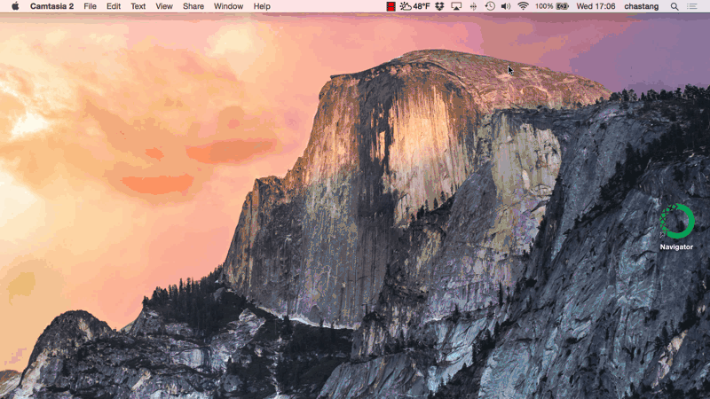

# How to Start and Run a Jupyter Notebook

As discussed in the [introduction](introduction.html), Jupyter notebooks provide a tremendous advantage for scientific computing, analysis and visualization. Here, we will explain how to start a Jupyter notebook. We will present just enough information to get you started. For a more complete treatment of Jupyter notebook software, please read the [official documentation](https://jupyter-notebook.readthedocs.org/en/latest/).

In the previous section, we explained how to download and install the bells and whistles of Python with Anaconda for both [Mac OS X](conda-osx.html) and [Windows](conda-windows.html). Now, armed with this experience, we will demonstrate how to start a Jupyter notebook in order to run Python code.

The Jupyter Notebook software is included in the Python installation we obtained from Anaconda. There are at least two scenarios in which you may want to run a Jupyter notebook:

1.  You aim to further experiment with, or augment, an existing Jupyter notebook - like the ones that already exist within a repository in github.
2.  You want to develop a Jupyter notebook or series of notebooks for uses such as supplementing teaching material, or for a scholarly journal article, for example.  

In both cases, you will want to start the Jupyter notebook in a specific folder.

### Starting a Jupyter Notebook in a Specific Folder

On Mac OS X, create a Desktop folder with the Finder called `my-notebook`. [In the last section](conda-osx.html), we learned how to start the OS X Terminal. Launch the Terminal again so that we may start Jupyter. Change to that directory (i.e. open the newly created `my-notebook` folder) with the `cd` command: `cd ~/Desktop/my-notebook`. The `~` character is a shortcut to indicate you are at your home directory.

On Windows, [create a Desktop folder](http://windows.microsoft.com/en-us/windows/create-new-folder) called `my-notebook`. Hold down the shift key and right-click on the newly created folder. A context menu will appear and there will be an option to, "Open command window here". Click this entry to launch the Windows Command Prompt at that specific location.

We can now start our Jupyter notebook with this command:

    jupyter notebook

Once entered, this command will automatically launch your default web browser with an empty notebook tree or directory.

To actually create a notebook, go to the New, Python 3 menu item.

Enter some code in the first cell:

    print("hello world")

and press Shift-Enter to actually run the cell yielding

    hello world

<!-- Cannot handle in pure markdown b/c of onclick -->

### Obtaining Existing Notebooks from Github

Alternatively, you can obtain your notebooks from a github project. For example, the [Unidata Python Workshop](https://github.com/Unidata/unidata-python-workshop) project (see the `notebooks` subfolder) has a series of notebooks on exploring Unidata technology with Python. Please see the [section on git and github](conda-osx.html) to clone this or any other repository containing Jupyter notebooks. At that point, you can go to your folder where the repository has been cloned and start Jupyter with the `jupyter notebook` command.

## MyBinder and Starting your Notebook in the Cloud

[MyBinder](http://mybinder.org/) is a third option for working with Jupyter notebooks but does not involve running any software on your computer. If the project has enabled MyBinder technology, you will see a  badge on the github project page. [MyBinder is available for the Unidata Python Workshop notebooks](https://github.com/Unidata/unidata-python-workshop).
